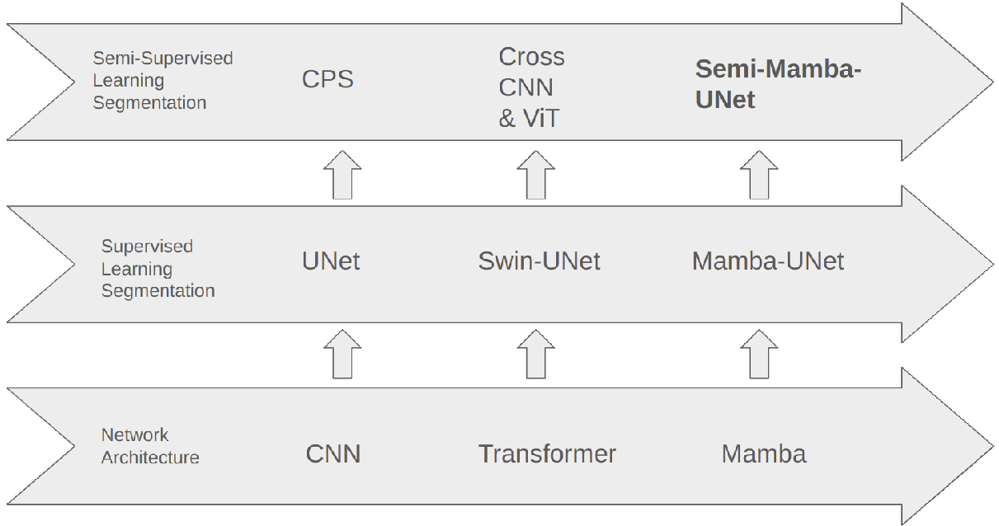
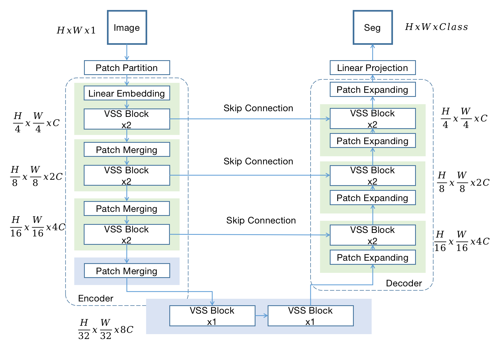

# Mamba-UNet

Mamba-UNet: Unet-like Pure Visual Mamba for Medical Image Segmentation

The position of Mamba-UNet


Semi-Mamba-UNet: Pixel-Level Contrastive Cross-Supervised Visual Mamba-based UNet for Semi-Supervised Medical Image Segmentation

The position of Semi-Mamba-UNet



Weak-Mamba-UNet: Visual Mamba Makes CNN and ViT Work Better for Scribble-based Medical Image Segmentation

The introduction of Scribble Annotation


Mamba-UNet




## Mamba-UNet Zoo

- [x] Mamba-UNet -> [[Paper Link]](https://github.com/ziyangwang007/Mamba-UNet/blob/main/MambaUNet.pdf) Released in 6/Feb/2024.
- [x] Semi-Mamba-UNet -> [[Paper Link]](https://github.com/ziyangwang007/Mamba-UNet/blob/main/SemiMambaUNet.pdf) Released in 10/Feb/2024.
- [x] Weak-Mamba-UNet -> [[Paper Link]](https://github.com/ziyangwang007/Mamba-UNet/blob/main/WeakMambaUNet.pdf) Released in 16/Feb/2024.
- [x] Code for Mamba-UNet
- [x] Code for Semi-Mamba-UNet
- [ ] Code for Weak-Mamba-UNet (in Progress, released soon.)
- [ ] Dataset with TotalSegmentator  (in Progress, released soon.)
- [ ] 3D Mamba-UNet 
- [ ] VMambaMorph
- [ ] Dataset with Multi-Atlas Abdomen Labeling Challenge Dataset 


## Requirements
* Pytorch, MONAI 
* Some basic python packages: Torchio, Numpy, Scikit-image, SimpleITK, Scipy, Medpy, nibabel, tqdm ......

```
cd casual-conv1d

python setup.py install
```

```
cd mamba

python setup.py install
```


## Usage

1. Clone the repo:
```
git clone https://github.com/ziyangwang007/Mamba-UNet.git 
cd Mamba-UNet
```

2. Download Pretrained Model

Download through [Google Drive](https://drive.google.com/file/d/14RzbbBDjbKbgr0ordKlWbb69EFkHuplr/view?usp=sharing) for SwinUNet, and [Google Drive](https://drive.google.com/file/d/1uUPsr7XeqayCxlspqBHbg5zIWx0JYtSX/view?usp=sharing) for Mamba-UNet, and save in 'code/pretrained_ckpt'.

3. Download Dataset

Download ACDC for Semi-/Supervised learning through [Google Drive](https://drive.google.com/file/d/1F3JzBSIURtFJkfcExBcT6Hu7Ar5_f8uv/view?usp=sharing), and save in 'data/ACDC' folder. Download ACDC for Weak-Supervised learning through [Google Drive](https://drive.google.com/file/d/1XR_Id0wdvXY9QeKtdOdgJHKVJ-nVr2j1/view?usp=sharing), and save in 'data' folder.


4. Train 2D UNet
```
python train_fully_supervised_2D.py --root_path ../data/ACDC --exp ACDC/unet --model unet --max_iterations 10000 --batch_size 24
```

5. Train SwinUNet
```
python train_fully_supervised_2D_ViT.py --root_path ../data/ACDC --exp ACDC/swinunet --model swinunet --max_iterations 10000 --batch_size 24
```

6. Train Mamba-UNet
```
python train_fully_supervised_2D_VIM.py --root_path ../data/ACDC --exp ACDC/VIM --model mambaunet --max_iterations 10000 --batch_size 24 
```

7. Train Semi-Mamba-UNet when 5% as labeled data
```
python train_Semi_Mamba_UNet.py --root_path ../data/ACDC --exp ACDC/Semi_Mamba_UNet --max_iterations 30000 --labeled_num 3 --batch_size 16 --labeled_bs 8
```

8. Train Semi-Mamba-UNet when 10% as labeled data
```
python train_Semi_Mamba_UNet.py --root_path ../data/ACDC --exp ACDC/Semi_Mamba_UNet --max_iterations 30000 --labeled_num 7 --batch_size 16 --labeled_bs 8
```

9. Train UNet with Mean Teacher when 5% as labeled data
```
python train_mean_teacher_2D.py --root_path ../data/ACDC --model unet --exp ACDC/Mean_Teacher --max_iterations 30000 --labeled_num 3 --batch_size 16 --labeled_bs 8
```

10. Train SwinUNet with Mean Teacher when 5% as labeled data
```
python train_mean_teacher_ViT.py --root_path ../data/ACDC --model swinunet --exp ACDC/Mean_Teacher_ViT --max_iterations 30000 --labeled_num 3 --batch_size 16 --labeled_bs 8
```

11. Train UNet with Mean Teacher when 10% as labeled data
```
python train_mean_teacher_2D.py --root_path ../data/ACDC --model unet --exp ACDC/Mean_Teacher --max_iterations 30000 --labeled_num 7 --batch_size 16 --labeled_bs 8
```

12. Train SwinUNet with Mean Teacher when 10% as labeled data
```
python train_mean_teacher_ViT.py --root_path ../data/ACDC --model swinunet --exp ACDC/Mean_Teacher_ViT --max_iterations 30000 --labeled_num 7 --batch_size 16 --labeled_bs 8
```

13. Train UNet with Uncertainty Aware Mean Teacher when 5% as labeled data
```
python train_uncertainty_aware_mean_teacher_2D.py --root_path ../data/ACDC --model unet --exp ACDC/Uncertainty_Aware_Mean_Teacher --max_iterations 30000 --labeled_num 3 --batch_size 16 --labeled_bs 8
```

14. Train SwinUNet with Uncertainty Aware Mean Teacher when 5% as labeled data
```
python train_uncertainty_aware_mean_teacher_2D_ViT.py --root_path ../data/ACDC --model swinunet --exp ACDC/Uncertainty_Aware_Mean_Teacher_ViT --max_iterations 30000 --labeled_num 3 --batch_size 16 --labeled_bs 8
```

15. Train UNet with Uncertainty Aware Mean Teacher when 10% as labeled data
```
python train_uncertainty_aware_mean_teacher_2D.py --root_path ../data/ACDC --model unet --exp ACDC/Uncertainty_Aware_Mean_Teacher --max_iterations 30000 --labeled_num 7 --batch_size 16 --labeled_bs 8
```

16. Train SwinUNet with Uncertainty Aware Mean Teacher when 10% as labeled data
```
python train_uncertainty_aware_mean_teacher_2D_ViT.py --root_path ../data/ACDC --model swinunet --exp ACDC/Uncertainty_Aware_Mean_Teacher_ViT --max_iterations 30000 --labeled_num 7 --batch_size 16 --labeled_bs 8
```

17. Test
```
python test_2D_fully.py --root_path ../data/ACDC --exp ACDC/xxx --model xxx
```

## Q&A

1. Q: Performance: I find my results are slightly lower than your reported results.

A: Please do not worry. The performance depends on many factors, such as how the data is split, how the network is initialized, how you write the evaluation code for Dice, Accuray, Precision, Sensitivity, Specificity, and even the type of GPU used. What I want to emphasize is that you should maintain your hyper-parameter settings and test some other baseline methods(fair comparsion). If method A has a lower/higher Dice Coefficient than the reported number, it's likely that methods B and C will also have lower/higher Dice Coefficients than the numbers reported in the paper.

2. Q: Network Block: What is the network block you used? What is the difference between Mamba-XXXNet?

A: I understand that there are so many Mamba related papers now, such as Vision Mamba, Visual Mamba, SegMemba... In this project, I integrate VMamba into U-shape network. The reference of VMamba is: Liu, Yue, et al. "Vmamba: Visual state space model." arXiv preprint arXiv:2401.10166 (2024).

3. Q: Concurrent Work: I found similar work about the integration of Mamba into UNet.

A: I am glad to see and acknowledge that there should be similar work. Mamba is a novel architecture, and it is obviously valuable to explore integrating Mamba with segmentation, detection, registration, etc. I am pleased that we all find Mamba efficient in some cases. This GitHub repository was developed on the 6th of February 2024, and I would not be surprised if people have proposed similar work from the end of 2023 to future. Also, I have only tested a limited number of baseline methods with a single dataset. Please make sure to read other related work around Mamba/Visual Mamba with UNet/VGG/Resnet etc.

4. Q: Other Dataset: I want to try MambaUNet with other segmentation dataset, do you have any suggestions?

A: I recommend to start with UNet, as it often proves to be the most efficient architecture. Based on my experience with various segmentation datasets, UNet can outperform alternatives like TransUNet and SwinUNet. Therefore, UNet should be your first choice. Transformer-based UNet variants, which depend on pretraining, have shown promising results, especially with larger datasets—although such extensive datasets are uncommon in medical imaging. In my view, MambaUNet not only offers greater efficiency but also more promising performance compared to Transformer-based UNet. However, it's crucial to remember that MambaUNet, like Transformer, necessitates pretraining (e.g. on ImageNet).

5. Q: Colloboration: Could I discuss with you about other topic, like Image Registration, Human Pose Estimation, Image Fusion, and etc.

A: I would also like to do some amazing work. Connect with me via ziyang [dot] wang17 [at] gmail [dot] com.


## Reference
```
@article{wang2024mamba,
  title={Mamba-UNet: UNet-Like Pure Visual Mamba for Medical Image Segmentation},
  author={Wang, Ziyang and others},
  journal={arXiv preprint arXiv:2402.05079},
  year={2024}
}

@article{wang2024semimamba,
  title={Semi-Mamba-UNet: Pixel-Level Contrastive Cross-Supervised Visual Mamba-based UNet for Semi-Supervised Medical Image Segmentation},
  author={Wang, Ziyang and others},
  journal={arXiv preprint arXiv:2402.07245},
  year={2024}
}

@article{wang2024weakmamba,
  title={Weak-Mamba-UNet: Visual Mamba Makes CNN and ViT Work Better for Scribble-based Medical Image Segmentation},
  author={Wang, Ziyang and others},
  journal={arXiv preprint arXiv:2402.10887},
  year={2024}
}
```


## Acknowledgement
SSL4MIS [Link](https://github.com/HiLab-git/SSL4MIS), Segmamba [Link](https://github.com/ge-xing/SegMamba), SwinUNet [Link](https://github.com/HuCaoFighting/Swin-Unet), Visual Mamba [Link](https://github.com/MzeroMiko/VMamba).