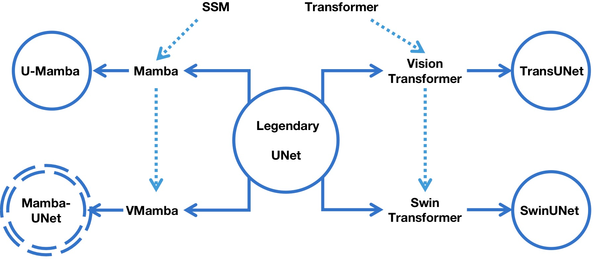
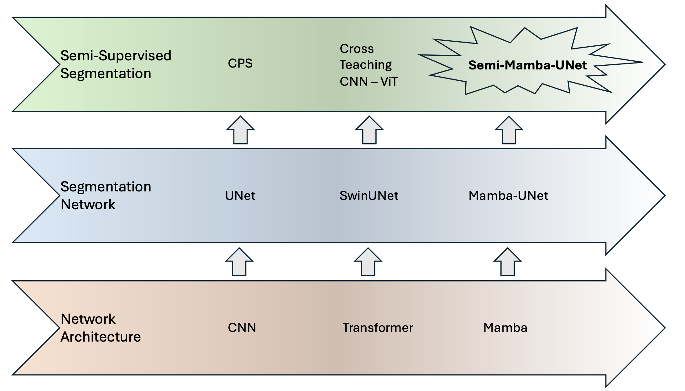
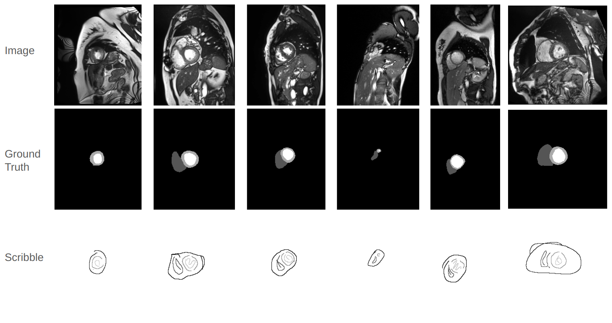
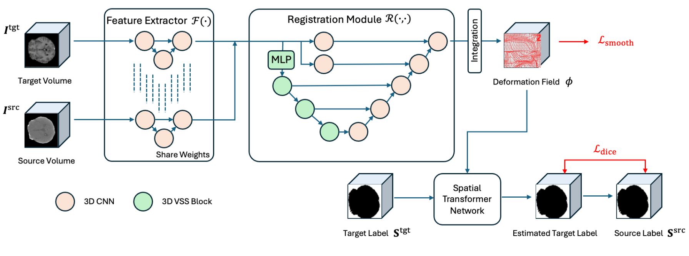
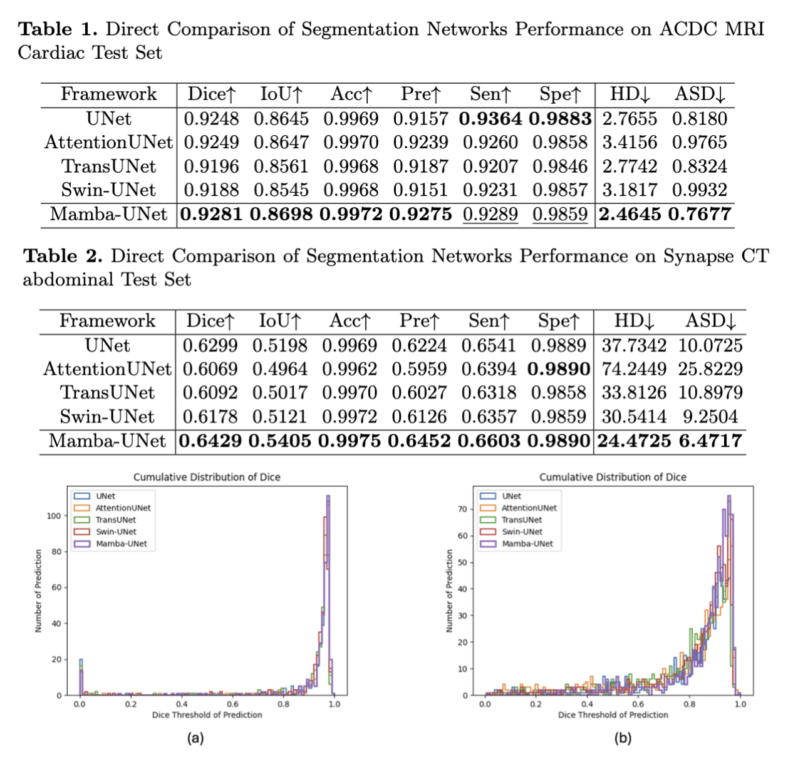
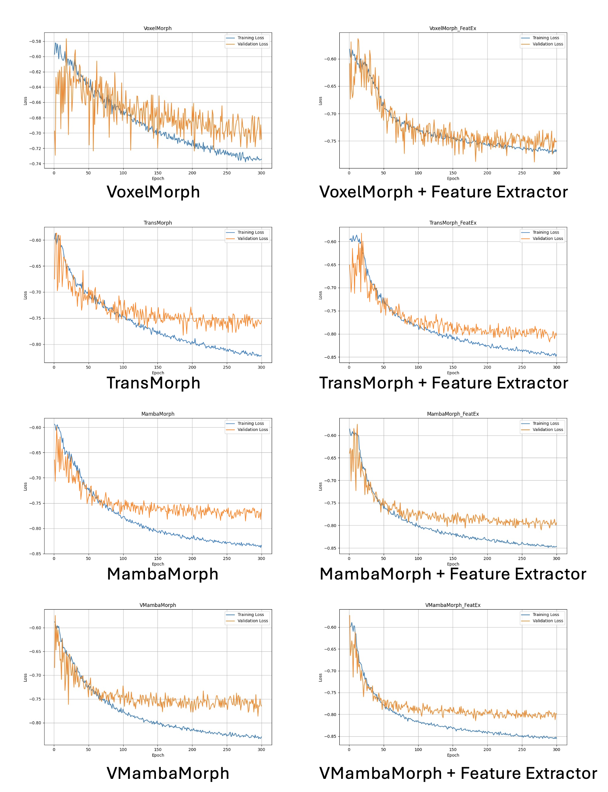

<div align="center">
<h1> Mamba-UNet Zoo </h1>

</div>


## Contents ###
- [Work List](#Work-List)
- [Graphical Abstract](#Graphical-Abstract)
- [Results](#Results)
- [Requirements](#Requirements)
- [Usage](#Usage)
- [Q&A](#Q&A)
- [Reference](#reference)
 


## Work List 

Project
- [x] Mamba-UNet -> [[Paper Link]](https://github.com/ziyangwang007/Mamba-UNet/blob/main/pdf/MambaUNet.pdf) 
- [x] Semi-Mamba-UNet -> [[Paper Link]](https://github.com/ziyangwang007/Mamba-UNet/blob/main/pdf/SemiMambaUNet.pdf) 
- [x] Weak-Mamba-UNet -> [[Paper Link]](https://github.com/ziyangwang007/Mamba-UNet/blob/main/pdf/WeakMambaUNet.pdf)
- [x] VMambaMorph -> [[Paper Link]](https://github.com/ziyangwang007/Mamba-UNet/blob/main/pdf/VMambaMorph.pdf)
- [x] Survey on Visual Mamba -> [[Paper Link]](https://arxiv.org/abs/2404.15956)

Code
- [x] Code for Mamba-UNet -> [[Link]](https://github.com/ziyangwang007/Mamba-UNet/blob/main/code/train_fully_supervised_2D_VIM.py)
- [x] Code for Semi-Mamba-UNet -> [[Link]](https://github.com/ziyangwang007/Mamba-UNet/blob/main/code/train_Semi_Mamba_UNet.py)
- [x] Code for Weak-Mamba-UNet -> [[Link]](https://github.com/ziyangwang007/Weak-Mamba-UNet)
- [x] Code for VMambaMorph -> [[Link]](https://github.com/ziyangwang007/VMambaMorph)
- [x] Paper List for Visual Mamba -> [[Link]](https://github.com/ziyangwang007/Awesome-Visual-Mamba)

More Experiments
- [x] Dataset of ACDC MRI Cardiac MICCAI Challenge  -> [[Official]](https://www.creatis.insa-lyon.fr/Challenge/acdc/databases.html) [[Google Drive]](https://drive.google.com/file/d/1F3JzBSIURtFJkfcExBcT6Hu7Ar5_f8uv/view?usp=sharing) [[Baidu Netdisk]](https://pan.baidu.com/s/1LS6VHujD8kvuQikbydOibQ)
- [x] Dataset of Synapse CT Abdomen MICCAI Challenge  -> [[Official]](https://www.synapse.org/#!Synapse:syn3193805/wiki/89480) [[Google Drive]](https://drive.google.com/file/d/1pO_YBx_3OCzadYQXzKsUqmXH6Ghv-z2y/view?usp=sharing)
- [x] Dataset of PROMISE12 Prostate MR MICCAI Challenge  -> [[Official]](https://promise12.grand-challenge.org/) [[Google Drive]](https://drive.google.com/file/d/1jboocJQq3VP0CowK0xrnPV5aqKQhqUaW/view?usp=sharing)
- [ ] Dataset of TotalSegmentator  (in Progress, released soon.)


## Graphical Abstract

Mamba-UNet: Unet-like Pure Visual Mamba for Medical Image Segmentation

The position of Mamba-UNet




Semi-Mamba-UNet: Pixel-Level Contrastive Cross-Supervised Visual Mamba-based UNet for Semi-Supervised Medical Image Segmentation

The position of Semi-Mamba-UNet



Weak-Mamba-UNet: Visual Mamba Makes CNN and ViT Work Better for Scribble-based Medical Image Segmentation

The introduction of Scribble Annotation



VMambaMorph: a Visual Mamba-based Framework with Cross-Scan Module for Deformable 3D Image Registration




Mamba-UNet


## Results

Mamba-UNet



VMambaMorph



<sub>Mamba-UNet: All the baseline methods/datasets are with same hyper-parameter setting (10,000 iterations, learning rate, optimizer and etc).</sub> <br>
<sub>VMambaMorph: All the baseline methods are with same hyper-parameter setting (300 epoches, learning rate, optimizer and etc).</sub>


## Requirements
* Pytorch, MONAI 
* Some basic python packages: Torchio, Numpy, Scikit-image, SimpleITK, Scipy, Medpy, nibabel, tqdm ......

```shell
cd casual-conv1d

python setup.py install
```

```shell
cd mamba

python setup.py install
```


## Usage

1. Clone the repo:
```shell
git clone https://github.com/ziyangwang007/Mamba-UNet.git 
cd Mamba-UNet
```

2. Download Pretrained Model

Download through [Google Drive](https://drive.google.com/file/d/14RzbbBDjbKbgr0ordKlWbb69EFkHuplr/view?usp=sharing) for SwinUNet, and [[Google Drive]](https://drive.google.com/file/d/1uUPsr7XeqayCxlspqBHbg5zIWx0JYtSX/view?usp=sharing) for Mamba-UNet, and save in `../code/pretrained_ckpt`.

3. Download Dataset

3.1 Download ACDC for Semi-/Supervised learning through [[Google Drive]](https://drive.google.com/file/d/1F3JzBSIURtFJkfcExBcT6Hu7Ar5_f8uv/view?usp=sharing) or [[Baidu Netdisk]](https://pan.baidu.com/s/1LS6VHujD8kvuQikbydOibQ) with passcode: 'kafc', and save in `../data/ACDC` folder. 

3.2 Download ACDC for Weak-Supervised learning through [[Google Drive]](https://drive.google.com/file/d/1XR_Id0wdvXY9QeKtdOdgJHKVJ-nVr2j1/view?usp=sharing), and save in `../data` folder.

3.3 Download Synapse for Semi-/Supervised learning through [[Google Drive]](https://drive.google.com/file/d/1pO_YBx_3OCzadYQXzKsUqmXH6Ghv-z2y/view?usp=sharing), and save in `../data/Synapse` folder.

3.4 Download PROMISE12 for Semi-/Supervised learning through [[Google Drive]](https://drive.google.com/file/d/1jboocJQq3VP0CowK0xrnPV5aqKQhqUaW/view?usp=sharing), and save in `../data/Prostate` folder. 

4. Train 2D UNet
```shell
python train_fully_supervised_2D.py --root_path ../data/ACDC --exp ACDC/unet --model unet --max_iterations 10000 --batch_size 24 --num_classes 4 

python train_fully_supervised_2D.py --root_path ../data/Prostate --exp Prostate/unet --model unet --max_iterations 10000 --batch_size 24 --num_classes 2
```

5. Train SwinUNet
```shell
python train_fully_supervised_2D_ViT.py --root_path ../data/ACDC --exp ACDC/swinunet --model swinunet --max_iterations 10000 --batch_size 24 --num_classes 4 

python train_fully_supervised_2D_ViT.py --root_path ../data/Prostate --exp Prostate/swinunet --model swinunet --max_iterations 10000 --batch_size 24 --num_classes 2 
```

6. Train Mamba-UNet
```shell
python train_fully_supervised_2D_VIM.py --root_path ../data/ACDC --exp ACDC/VIM --model mambaunet --max_iterations 10000 --batch_size 24  --num_classes 4 

python train_fully_supervised_2D_VIM.py --root_path ../data/Prostate --exp Prostate/VIM --model mambaunet --max_iterations 10000 --batch_size 24  --num_classes 2
```

7. Train Semi-Mamba-UNet when 3 cases as labeled data
```shell
python train_Semi_Mamba_UNet.py --root_path ../data/ACDC --exp ACDC/Semi_Mamba_UNet --max_iterations 30000 --labeled_num 3 --batch_size 16  --num_classes 4
```

8. Train Semi-Mamba-UNet when 7 cases as labeled data
```shell
python train_Semi_Mamba_UNet.py --root_path ../data/ACDC --exp ACDC/Semi_Mamba_UNet --max_iterations 30000 --labeled_num 7 --batch_size 16  --num_classes 4 
```


9. Train Semi-Mamba-UNet when 8 cases as labeled data
```shell
python train_Semi_Mamba_UNet.py --root_path ../data/Prostate --exp Prostate/Semi_Mamba_UNet --max_iterations 30000 --labeled_num 8 --batch_size 16  --num_classes 2
```

10. Train Semi-Mamba-UNet when 12 cases as labeled data
```shell
python train_Semi_Mamba_UNet.py --root_path ../data/Prostate --exp Prostate/Semi_Mamba_UNet --max_iterations 30000 --labeled_num 12 --batch_size 16 --num_classes 2
```

11. Train UNet with Mean Teacher when 3 cases as labeled data
```shell
python train_mean_teacher_2D.py --root_path ../data/ACDC --model unet --exp ACDC/Mean_Teacher --max_iterations 30000 --labeled_num 3 --batch_size 16 --
```

12. Train SwinUNet with Mean Teacher when 3 cases as labeled data
```shell
python train_mean_teacher_ViT.py --root_path ../data/ACDC --model swinunet --exp ACDC/Mean_Teacher_ViT --max_iterations 30000 --labeled_num 3 --batch_size 16 
```

13. Train UNet with Mean Teacher when 7 cases as labeled data
```shell
python train_mean_teacher_2D.py --root_path ../data/ACDC --model unet --exp ACDC/Mean_Teacher --max_iterations 30000 --labeled_num 7 --batch_size 16 --num_classes 4 
```

14. Train SwinUNet with Mean Teacher when 7 cases as labeled data
```shell
python train_mean_teacher_ViT.py --root_path ../data/ACDC --model swinunet --exp ACDC/Mean_Teacher_ViT --max_iterations 30000 --labeled_num 7 --batch_size 16 --num_classes 4 
```

15. Train UNet with Mean Teacher when 8 cases as labeled data
```shell
python train_mean_teacher_2D.py --root_path ../data/Prostate --model unet --exp Prostate/Mean_Teacher --max_iterations 30000 --labeled_num 8 --batch_size 16 --num_classes 2
```

16. Train SwinUNet with Mean Teacher when 8 cases as labeled data
```shell
python train_mean_teacher_ViT.py --root_path ../data/Prostate --model swinunet --exp Prostate/Mean_Teacher_ViT --max_iterations 30000 --labeled_num 8 --batch_size 16  --num_classes 2
```

17. Train UNet with Mean Teacher when 12 cases as labeled data
```shell
python train_mean_teacher_2D.py --root_path ../data/Prostate --model unet --exp Prostate/Mean_Teacher --max_iterations 30000 --labeled_num 12 --batch_size 16 --num_classes 2
```

18. Train SwinUNet with Mean Teacher when 12 cases as labeled data
```shell
python train_mean_teacher_ViT.py --root_path ../data/Prostate --model swinunet --exp Prostate/Mean_Teacher_ViT --max_iterations 30000 --labeled_num 12 --batch_size 16  --num_classes 2
```

19. Train UNet with Uncertainty Aware Mean Teacher when 3 cases as labeled data
```shell
python train_uncertainty_aware_mean_teacher_2D.py --root_path ../data/ACDC --model unet --exp ACDC/Uncertainty_Aware_Mean_Teacher --max_iterations 30000 --labeled_num 3 --batch_size 16 --num_classes 4 
```

20. Train SwinUNet with Uncertainty Aware Mean Teacher when 3 cases as labeled data
```shell
python train_uncertainty_aware_mean_teacher_2D_ViT.py --root_path ../data/ACDC --model swinunet --exp ACDC/Uncertainty_Aware_Mean_Teacher_ViT --max_iterations 30000 --labeled_num 3 --batch_size 16 --num_classes 4 
```

21. Train UNet with Uncertainty Aware Mean Teacher when 7 cases as labeled data
```shell
python train_uncertainty_aware_mean_teacher_2D.py --root_path ../data/ACDC --model unet --exp ACDC/Uncertainty_Aware_Mean_Teacher --max_iterations 30000 --labeled_num 7 --batch_size 16 --num_classes 4 
```

22. Train SwinUNet with Uncertainty Aware Mean Teacher when 7 cases as labeled data
```shell
python train_uncertainty_aware_mean_teacher_2D_ViT.py --root_path ../data/ACDC --model swinunet --exp ACDC/Uncertainty_Aware_Mean_Teacher_ViT --max_iterations 30000 --labeled_num 7 --batch_size 16 --num_classes 4 
```

23. Test
```shell
python test_2D_fully.py --root_path ../data/ACDC --exp ACDC/xxx --model xxx
```


24. For Image Registration

The training and testing for VoxelMorph, TransMorph, MambaMorph, and VMambaMorph can be checked through [[Link]](https://github.com/ziyangwang007/VMambaMorph)

24. For Weakly Supervised Image Segmentation

The training and testing for pCE, Weak-Mamba-UNet can be checked through [[Link]](https://github.com/ziyangwang007/Weak-Mamba-UNet)

## Q&A

1. Q: Performance: I find my results are slightly lower than your reported results.

A: Please do not worry. The performance depends on many factors, such as how the data is split, how the network is initialized, how you write the evaluation code for Dice, Accuray, Precision, Sensitivity, Specificity, and even the type of GPU used. What I want to emphasize is that you should maintain your hyper-parameter settings and test some other baseline methods(fair comparsion). If method A has a lower/higher Dice Coefficient than the reported number, it's likely that methods B and C will also have lower/higher Dice Coefficients than the numbers reported in the paper.

2. Q: Network Block: What is the network block you used? What is the difference between Mamba-XXXNet?

A: I understand that there are so many Mamba related papers now, such as Vision Mamba, Visual Mamba, SegMamba... In this project, I integrate VMamba into U-shape network. The reference of VMamba is: Liu, Yue, et al. "Vmamba: Visual state space model." arXiv preprint arXiv:2401.10166 (2024).

3. Q: Concurrent Work: I found similar work about the integration of Mamba into UNet.

A: I am glad to see and acknowledge that there should be similar work. Mamba is a novel architecture, and it is obviously valuable to explore integrating Mamba with segmentation, detection, registration, etc. I am pleased that we all find Mamba efficient in some cases. This GitHub repository was developed on the 6th of February 2024, and I would not be surprised if people have proposed similar work from the end of 2023 to future. Also, I have only tested a limited number of baseline methods with a single dataset. Please make sure to read other related work around Mamba/Visual Mamba with UNet/VGG/Resnet etc.

4. Q: Other Dataset: I want to try MambaUNet with other segmentation dataset, do you have any suggestions?

A: I recommend to start with UNet, as it often proves to be the most efficient architecture. Based on my experience with various segmentation datasets, UNet can outperform alternatives like TransUNet and SwinUNet. Therefore, UNet should be your first choice. Transformer-based UNet variants, which depend on pretraining, have shown promising results, especially with larger datasets—although such extensive datasets are uncommon in medical imaging. In my view, MambaUNet not only offers greater efficiency but also more promising performance compared to Transformer-based UNet. However, it's crucial to remember that MambaUNet, like Transformer, necessitates pretraining (e.g. on ImageNet).

5. Q: Colloboration: Could I discuss with you about other topic, like Image Registration, Human Pose Estimation, Image Fusion, and etc.

A: I would also like to do some amazing work. Connect with me via ziyang [dot] wang17 [at] gmail [dot] com.


## Reference
```bibtex
@article{wang2024mamba,
  title={Mamba-unet: Unet-like pure visual mamba for medical image segmentation},
  author={Wang, Ziyang and Zheng, Jian-Qing and Zhang, Yichi and Cui, Ge and Li, Lei},
  journal={arXiv preprint arXiv:2402.05079},
  year={2024}
}
@article{ma2024semimamba,
  title={Semi-Mamba-UNet: Pixel-Level Contrastive and Pixel-Level Cross-Supervised Visual Mamba-based UNet for Semi-Supervised Medical Image Segmentation},
  author={Ma, Chao and Wang, Ziyang},
  journal={arXiv preprint arXiv:2402.07245},
  year={2024}
}

@article{wang2024weakmamba,
  title={Weak-Mamba-UNet: Visual Mamba Makes CNN and ViT Work Better for Scribble-based Medical Image Segmentation},
  author={Wang, Ziyang and Ma, Chao},
  journal={arXiv preprint arXiv:2402.10887},
  year={2024}
}

@article{wang2024vmambamorph,
  title={VMambaMorph: a Multi-Modality Deformable Image Registration Framework based on Visual State Space Model with Cross-Scan Module
},
  author={Wang, Ziyang and Zheng, Jian-Qing and Ma, Chao and Guo, Tao},
  journal={arXiv preprint arXiv:2404.05105},
  year={2024}
}

@article{zhang2024survey,
  title={A Survey on Visual Mamba},
  author={Zhang, Hanwei and Zhu, Ying and Wang, Dan and Zhang, Lijun and Chen, Tianxiang and Wang, Ziyang and Ye, Zi},
  journal={arXiv preprint arXiv:2404.15956},
  year={2024}
}
```


## Contact

ziyang [dot] wang17 [at] gmail [dot] com


## Acknowledgement
SSL4MIS [Link](https://github.com/HiLab-git/SSL4MIS), Segmamba [Link](https://github.com/ge-xing/SegMamba), SwinUNet [Link](https://github.com/HuCaoFighting/Swin-Unet), Visual Mamba [Link](https://github.com/MzeroMiko/VMamba).
